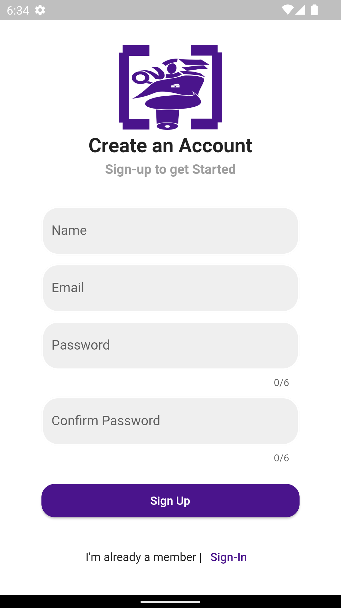
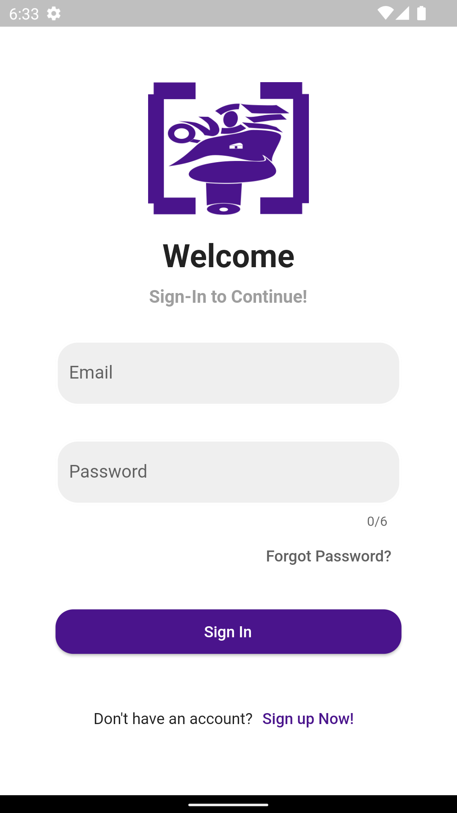

# Quiz House

This is a flutter application/Game. UI of this app is responsive. MVVM pattern with services and repository is used for this app. Sqlite database is used for this app.

## Components Used

- Android Studio
- Different flutter packages
  - Provider (For state management of MVVM pattern)
  - carousel_slider (For carousel with auto sliding animation)
  - percent_indicator
  - sqflite (For sqlite database)
  - email_validator (For validating email)
  - crypto (For password encryption and decryption)
  - flutter_spinkit (For Loading screen)
  - flutter_launcher_icons (For custom Launcher icon add)
- Inkscape (For creating app icon)
    
## Features of This App

- [Register](#register)
- [Login](#login)
- [Home](#home)
  - [Challange Room](#challange-room)
  - [Ongoing Tournament](#ongoing-tournament)
  - [BCS](#bcs)
  - [Category](#category)
- [Shop](#shop)
- [Logout](#logout)

## Features details with screenshots

### Register

For register all possible scenario is also implemented, for example giving email in wrong format etc.

### Login 

Here 'Forgot Password' feature is not implemented

### Home

