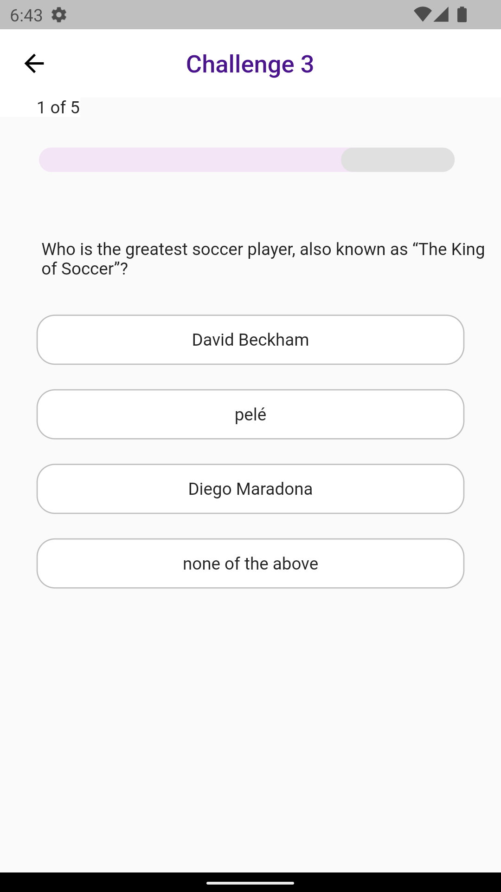

# Quiz House

This is a flutter application/Game. UI of this app is responsive. MVVM pattern with services and repository is used for this app. Sqlite database is used for this app.

## Components Used

- Android Studio
- Different flutter packages
  - Provider (For state management of MVVM pattern)
  - carousel_slider (For carousel with auto sliding animation)
  - percent_indicator
  - sqflite (For sqlite database)
  - email_validator (For validating email)
  - crypto (For password encryption and decryption)
  - flutter_spinkit (For Loading screen)
  - flutter_launcher_icons (For custom Launcher icon add)
- Inkscape (For creating app icon)
    
## Features of This App

- [Register](#register)
- [Login](#login)
- [Home](#home)
  - [Challenge Room](#challenge-room)
  - [Ongoing Tournament](#ongoing-tournament)
  - [BCS](#bcs)
  - [Category](#category)
- [Playing Quiz](#playing-quiz)
- [Shop](#shop)
- [App exit alert](#app-exit-alert)
- [Logout](#logout)

## Features details with screenshots

### Register

For register all possible scenario is also implemented, for example giving email in wrong format etc.

### Login 

Here 'Forgot Password' feature is not implemented

### Home

#### AppBar

#### Player Status Bar

#### Challange Room

#### Ongoing Tournament

#### BCS

#### Category

### Playing Quiz

All possible scenario is implemented for playing quiz. For example, when an answer is selected you can't change the answer etc. When image is part of the question, image will also show up. But for now no question have an image.

When time run out, correct answer is shown.

What happens when answer is incorrect?

What happens when answer is correct?

What happens when player accidently press back button when playing quiz?

### Shop

### App exit alert

### Logout

You can Logout

